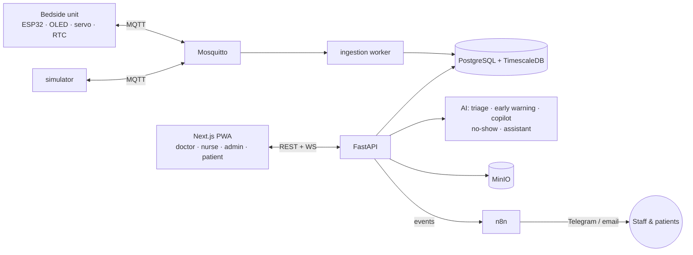

# Ward · وَرد

**The patient journey, connected.** A smart-hospital prototype built for **HackCure @ ESEN** (October 2026).

*Ward* means "rose" in Arabic and "hospital ward" in English. It links the patient, nurse, doctor and hospital
administration through **one shared patient record**, and it automates the patient process end-to-end: urgency-aware
booking, paperless records, medication reminders at the bedside, early-warning alerts and automatic follow-ups.

## The problem

In Tunisian public hospitals:
- Patients who need care quickly often get appointments 6–12 months away.
- Doctors and nurses log, search and re-read **paper** records every day.
- Patient, nurse, doctor and administration have no shared system.

## What Ward does

| For | What they get |
|---|---|
| **Patient** | A **bedside unit** with a touch screen, medication reminders that work offline, a rotating pill carousel and a call-nurse button. A web app to request appointments and follow home care after discharge. |
| **Nurse** | Tap an RFID badge on the device to log vitals. A live ward board with **early-warning alerts** (NEWS2-based) on screen and on Telegram. A med-round checklist. |
| **Doctor** | Patient list with an **AI daily summary**, vitals trends, prescriptions that go straight to the bedside unit, and **adherence**: which doses were taken or missed. |
| **Admin** | An **AI-ranked waitlist** that admins confirm or override, bed and device assignment, and a hospital dashboard. |

**Principles:**
- **Human in the loop:** AI only suggests, and a person confirms every change to care or bookings.
- **Privacy by design:** self-hosted, role-based access, an audit log of every record read, and anonymised LLM calls (Tunisian Organic Law 2004-63 / INPDP).
- **Honest prototype:** vitals are simulated (the bedside unit has no sensors) and the AI is not clinically validated.
- **Synthetic data only.**

## Architecture



Full diagrams (use cases, patient-journey swimlane, hardware, AI layer): [`docs/architecture.md`](docs/architecture.md).

| Layer | Tech |
|---|---|
| Device | ESP32, PlatformIO (Arduino), SSD1306 OLED, SG90 servo, DS1307 RTC · developed in Wokwi |
| Messaging | Mosquitto (MQTT) |
| Backend | FastAPI, SQLAlchemy, Alembic |
| Data | PostgreSQL + TimescaleDB, MinIO |
| Web | Next.js PWA |
| Automation | n8n (self-hosted) |
| AI | Claude API or a local model through one privacy wrapper, with deterministic fallbacks |
| Deploy | Docker Compose |

## Quick start

Requirements: Docker Desktop. For lane work: Python 3.12, Node 22 and PlatformIO.

```bash
git clone https://github.com/Faouzi-Blibech/smarty-hospital-.git && cd smarty-hospital-
cp .env.example .env
docker compose -f infra/docker-compose.yml --env-file .env up --build
```

| Service | URL |
|---|---|
| Web app | http://localhost:3000 |
| API + docs | http://localhost:8000/docs · health at `/health` |
| n8n | http://localhost:5678 |
| MinIO console | http://localhost:9001 |
| MQTT | `mqtt://localhost:1883` |

No hardware? Run the simulator:

```bash
pip install -r simulator/requirements.txt
python simulator/sim.py --device bsu-001 --patient p-0001
```

## Repository

```
firmware/    ESP32 bedside unit (PlatformIO) · PINMAP.md
hardware/    BOM, wiring, servo pill holder
simulator/   fake devices speaking the MQTT contract
backend/     FastAPI app, models, IoT ingestion, AI modules (app/ai/)
web/         Next.js PWA (all role views)
n8n/         exported automation workflows
infra/       docker-compose, Mosquitto config
docs/        architecture, integration contracts, design spec
plans/       one implementation plan per team member
```

## Team

| | Lane | Owns the demo flow for |
|---|---|---|
| **Faouzi Blibech** (lead) | Web app, AI modules, n8n, pitch | Doctor & Admin |
| **Hedi** | Simulator, no-show model, device firmware (Wokwi) | Patient |
| **Wali** | Core backend, IoT, early warning, real-board build | Nurse |

How we work together (ownership, contracts, git rules): [`CLAUDE.md`](CLAUDE.md) · schedule and demo script: [`TEAM_PLAN.md`](TEAM_PLAN.md).

## Status

🚧 Hackathon build in progress (Day 0: foundation and contracts frozen).
