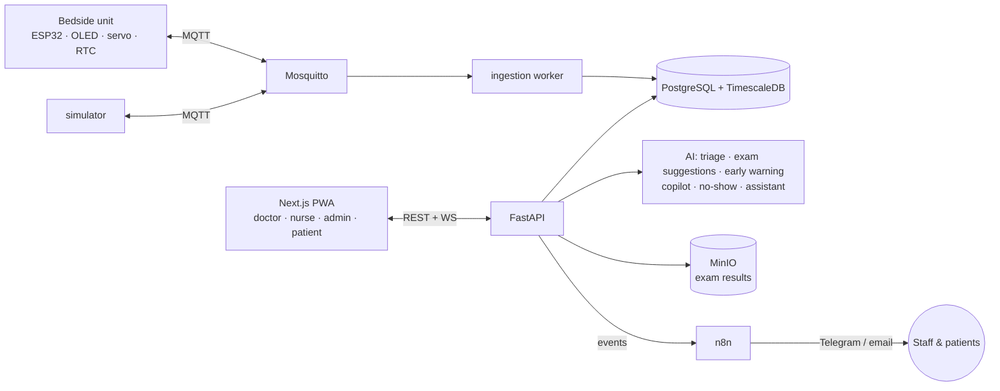

# Ward · وَرد

**The patient journey, connected.** A smart-hospital prototype built for **HackCure @ ESEN** (October 2026).

*Ward* means "rose" in Arabic and "hospital ward" in English. It links the patient, nurse, doctor and hospital
administration through **one shared patient record**, and it automates the patient process end to end:
- urgency-aware booking
- exams done *before* the visit, so one consultation is enough
- medication reminders at the bedside
- early-warning alerts
- automatic follow-ups

## The problem

In Tunisian public hospitals:
- Patients who need care quickly often get appointments 6–12 months away.
- A patient usually sees the doctor **twice**: once to be told which exams to do, then again with the results to get a diagnosis and treatment.
- Doctors and nurses log, search and re-read **paper** records every day.
- Patient, nurse, doctor and administration have no shared system.

The Ministry of Health is digitising hospital records for staff, and Sahetna.tn will give citizens their records with
a national health identifier (INS). Ward does not replace those systems. It connects the four roles around one patient
and automates the steps between them.

## What Ward does

| For | What they get |
|---|---|
| **Patient** | A **bedside unit** (OLED screen) that shows medication reminders even offline and turns a servo to the right pill slot. A web app to request an appointment, see which exams to do **before the visit**, check doses and vitals, ask a simple assistant, and follow home care after discharge. |
| **Nurse** | A live ward board with **early-warning alerts** (NEWS2-based) on screen and on Telegram, and a med-round checklist. Nurses of the performing department (Imaging, Laboratory, Cardiology) get an **exams worklist** and upload results to the patient's case. |
| **Doctor** | Patient list and record with vitals trends, prescriptions that go straight to the bedside unit, and adherence (which doses were taken or missed). The doctor also gets: <ul><li>an **AI daily summary** to review</li><li>**suggested exams** on each request, to order or drop</li><li>the uploaded results, ready at the visit</li></ul> |
| **Admin** | An **AI-ranked waitlist** to confirm or override. Each row shows exam progress ("Exams 2/3") and the hospital triage-scale level. Also bed and device assignment, staff, and a dashboard. |

**Principles:**
- **Human in the loop:** AI only suggests, and a person confirms every change to care, exams or bookings.
- **Privacy by design:**
  - The whole system is self-hosted, with role-based access.
  - Every record read is written to an audit log, and result files are served only through the API.
  - No patient data leaves the server unless an optional open LLM is switched on. Even then it is anonymised first (Tunisian Organic Law 2004-63 / INPDP).
- **Honest prototype:** vitals are simulated (the bedside unit has no sensors); the AI and the exam rules are not clinically validated; AI never reads scans or lab results.
- **Synthetic data only.**

## Architecture



Full diagrams are in [`docs/architecture.md`](docs/architecture.md): use cases, patient journey, the single-visit pathway, hardware and the AI layer.

| Layer | Tech |
|---|---|
| Device | ESP32, PlatformIO (Arduino), SSD1306 OLED, SG90 servo, DS1307 RTC · developed in Wokwi |
| Messaging | Mosquitto (MQTT) |
| Backend | FastAPI, SQLAlchemy, Alembic |
| Data | PostgreSQL + TimescaleDB, MinIO (exam result files) |
| Web | Next.js PWA |
| Automation | n8n (self-hosted) |
| AI | Hand-coded rules + small trained models (scikit-learn, optional Laya), plus an optional open LLM through one privacy wrapper. The LLM can be Groq (`openai/gpt-oss-120b`) or local Ollama. |
| Deploy | Docker Compose |

## Quick start

Requirements: Docker Desktop. For lane work: Python 3.12, Node 22 and PlatformIO.

```bash
git clone https://github.com/Faouzi-Blibech/smarty-hospital-.git && cd smarty-hospital-
cp .env.example .env
docker compose -f infra/docker-compose.yml --env-file .env up --build
docker compose -f infra/docker-compose.yml --env-file .env exec api python -m app.seed   # synthetic data, safe to re-run
```

| Service | URL |
|---|---|
| Web app | http://localhost:3000 |
| API + docs | http://localhost:8000/docs · health at `/health` |
| n8n | http://localhost:5678 |
| MinIO console | http://localhost:9001 |
| MQTT | `mqtt://localhost:1883` |

The web app runs on mock data by default. To use the real API, set `NEXT_PUBLIC_USE_MOCKS=0` in `.env` and rebuild `web`.

**Demo accounts** (all use the password `ward1234`):

| Email | Role |
|---|---|
| `doctor@ward.tn` | Doctor, Cardiology |
| `nurse@ward.tn` | Nurse, Cardiology |
| `nurse2@ward.tn` | Nurse, Internal Medicine |
| `imaging@ward.tn` | Nurse, Imaging (uploads X-rays and scans) |
| `lab@ward.tn` | Nurse, Laboratory (uploads lab results) |
| `admin@ward.tn` | Admin |
| `patient@ward.tn` | Patient (Amira, bed C-12) |

**AI options (`.env`):** `LLM_PROVIDER=none` is the default, and every module works without it. To let an open LLM rewrite the doctor's daily summary, set `LLM_PROVIDER=groq`, `GROQ_API_KEY=…` and `LLM_MODEL=openai/gpt-oss-120b`. For a local model, use `LLM_PROVIDER=local` with Ollama.

No hardware? Run the simulator:

```bash
pip install -r simulator/requirements.txt
python simulator/sim.py --device bsu-001 --patient p-0001
```

## Repository

```
firmware/    ESP32 bedside unit (PlatformIO) · PINMAP.md
hardware/    BOM, wiring, servo pill holder
simulator/   fake devices speaking the MQTT contract
backend/     FastAPI app, models, IoT ingestion, exams, AI modules (app/ai/)
web/         Next.js PWA (all role views)
n8n/         exported automation workflows
infra/       docker-compose, Mosquitto config
docs/        architecture, integration contracts, design specs and plans
plans/       one implementation plan per team member
```

## Team

| | Lane | Owns the demo flow for |
|---|---|---|
| **Faouzi Blibech** (lead) | Web app, AI modules, appointments and exams, n8n, pitch | Doctor & Admin |
| **Hedi** | Simulator, no-show model, device firmware (Wokwi) | Patient |
| **Wali** | Core backend, IoT, early warning, real-board build | Nurse |

How we work together (ownership, contracts, git rules): [`CLAUDE.md`](CLAUDE.md) · schedule and demo script: [`TEAM_PLAN.md`](TEAM_PLAN.md).

## Status

Hackathon build in progress.

**Working end to end on the real stack:**
- **Core:** login, patient records, vitals ingestion, alerts, prescriptions to the bedside schedule.
- **Appointments:** the AI-ranked waitlist, AI triage, the doctor's daily summary and the patient assistant.
- **Single-visit exam pathway:** suggested exams → doctor orders → department nurse uploads results → doctor reads them at the visit.

**Next:**
- n8n workflows: reminders, missed dose, alerts, slot backfill, exams ordered, results ready.
- The doctor's **case notebook**: questions about one patient, answered only from that patient's record, with citations. It is planned in [`docs/superpowers/plans/2026-10-09-case-notebook.md`](docs/superpowers/plans/2026-10-09-case-notebook.md).
- Simulator scenarios and the bedside firmware.
