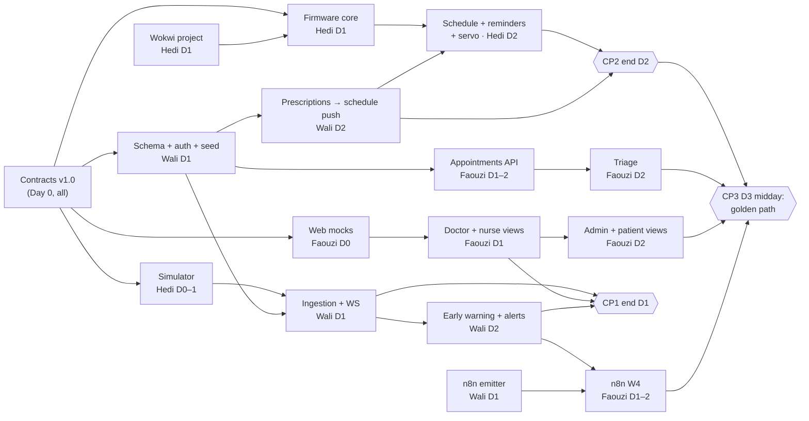

# Ward — Team Plan

Build window: **Day 0 Mon 2026-10-05 → Day 4 Fri 2026-10-09**. Sat 10-10 onward: buffer, pitch deck, Q&A prep.
Spec: `docs/superpowers/specs/2026-10-05-ward-foundation-design.md` · Contracts: `docs/contracts/` (v1.0, frozen).

## 0. Core first (agreed 2026-10-05)

The core of Ward is the medication loop: **the doctor prescribes, the bedside device gives the right dose at the right time, and the nurse and doctor see what happened.** On Day 0 we built extras (AI modules, n8n workflows) before any of it. Until step 6 below runs end to end once, **no new extra merges**. After that, extras come back in order of demo value.

| Step | What | Owner | When |
|---|---|---|---|
| 1 | Simulator scenarios: `dose_flow`, `call_nurse`, `abnormal`, `schedule_ack` | Hedi | Day 0 |
| 2 | Schema + seed: patients, staff, devices, prescriptions, `med_doses`, appointments | Wali | Day 1 |
| 3 | Ingestion + schedule push: device events into the DB; a prescription publishes the retained schedule | Wali | Day 1–2 |
| 4 | Doctor view: prescribe + see adherence (the screen that starts and ends the loop) | Faouzi | Day 1–2 |
| 5 | Bedside device in Wokwi: schedule on the OLED, servo turns at dose time, acks back | Hedi | Day 2 |
| 6 | Missed dose → nurse: backend emitter + n8n W3 + nurse view | Wali + Faouzi | Day 2 |
| 7 | Extras, in order: appointment reminders on the device, triage + waitlist, copilot, assistant | all | after 6 |

**Open team decisions** (not settled by this plan):
- Put appointments on the device: an appointments list in the MQTT schedule (contract bump), shown a day and an hour before. Check the 1024-byte message limit.
- Add one "Taken" button back to the device, so the patient really acts and the simulator stops faking `dose_taken`.
- Setting: hospital ward, or home care after discharge.
- Rewrite the pitch around the bedside loop, with the AI modules as supporting features.

## 1. Ownership

| Workstream | Owner | Priority | Notes |
|---|---|---|---|
| WS1 ESP32 listener firmware (Wokwi): MQTT, NVS schedule, DS1307 RTC, servo dose flow, acks | **Hedi** | core, built last | No sensors; same code on the real board |
| WS2 Device screens (SSD1306 OLED): home, dose reminder, alert banner, message toast | **Hedi** | core | Patient role owner |
| WS3 Real-board wiring (OLED, servo, RTC), PINMAP (with Hedi), servo pill holder | **Wali** | stretch | Only if the Wokwi path is green on Day 3 |
| WS4 IoT backend: Mosquitto config, ingestion worker, device registry, schedule push | **Wali** | core | |
| WS5 Early warning (NEWS2 partial + trend) + alerts + WebSocket | **Wali** | core | Nurse role owner |
| WS6 Core backend: scaffold, schema + migrations, seed, JWT + RBAC, audit, patients/records/prescriptions | **Wali** | core | |
| WS6b n8n event emitter (`integrations/n8n.py`) | **Wali** | core | Faouzi builds the workflows |
| WS7 No-show model + backfill ranking | **Hedi** | Day 1 | Moved earlier; the hardware lane is small now |
| WS8 Next.js PWA: doctor → nurse → admin → patient | **Faouzi** | core | Doctor + Admin role owner |
| WS9 n8n: W4, W3, W1 core; W2, W5, W6 stretch | **Faouzi** | core/stretch | |
| WS10 AI: triage (rules + trained model), copilot, assistant (Laya intents); no paper digitizer | **Faouzi** | after core step 6 | Hand-coded and trained, no LLM needed |
| WS11 Appointments & waitlist endpoints + n8n callbacks | **Faouzi** | core | On Wali's schema |
| WS12 Simulator (`simulator/`): all vitals, nurse taps, call-nurse, dose taken; `--companion` mode next to the ESP | **Hedi** | Day 0 | Main patient-side traffic source for the demo |
| WS13 Seed data | **Wali** | Day 1 | Finishes with the schema |
| WS14 Demo script + pitch | **Faouzi** (lead), all rehearse | Day 4+ | |

**Balance check:**
- **Faouzi** carries the widest surface (web + AI + n8n). It's offset by moving the core backend and the simulator away, and by making the assistant and W2/W5/W6 stretch goals.
- **Wali** carries the backend core, which is the heaviest after Day 1 because the mechanics shrink then.
- **Hedi** carries the simulator (the demo's whole patient-side traffic), the no-show model and a small listener firmware built last in Wokwi. He has spare capacity: he is first in line for the rebalance list (§7).

If anyone is behind at a checkpoint, the first thing to drop is that person's stretch items, then the rebalance list in §7.

## 2. Dependency graph

## 3. Day by day

### Day 0 — Mon 10-05 (half day, all together)
- [ ] All: read `CLAUDE.md`, `docs/architecture.md` and every contract, then sign off on contracts v1.0 (merge the foundation PR).
- [ ] All: `docker compose up` works on every laptop; `GET /health` returns ok.
- [ ] Hedi: simulator publishes vitals + events for `bsu-001` per the contract.
- [ ] Wali: parts inventory; list what is missing and order it today.
- [ ] Faouzi: web fixtures in `web/src/mocks/` matching `api.md`; Telegram bot created; n8n container reachable.
- **Done when:** the foundation PR is merged, the stack runs empty everywhere, and the simulator traffic is visible in `mosquitto_sub`.

### Day 1 — Tue 10-06 (parallel build on mocks)
- **Hedi:** no-show model (→ Faouzi); Wokwi project (ESP32 + OLED + servo + DS1307) boots; schedule logic with native tests.
- **Wali:** wiring of all I2C/SPI parts; schema + first migration; seed; JWT login + RBAC deps + audit; ingestion worker → `vitals` with dedupe; WS broadcast of `vital`; n8n emitter.
- **Faouzi:** doctor view (patient list + patient detail with a vitals chart) and nurse view (ward list, live vitals, alerts panel) on mocks; n8n W4 from a manual webhook test.
- **Checkpoint CP1 (end of Day 1):** simulator vitals appear live on the nurse view through the real API + WS.

### Day 2 — Wed 10-07 (parallel build)
- **Hedi:** ESP listener in Wokwi: NVS schedule + RTC reminders + OLED dose screen + servo + acks; `--companion` simulator answers `dose_taken`.
- **Wali:** prescriptions → `med_doses` → retained schedule publish; dose events update `med_doses`; early warning + alerts + `alert.critical` / `dose.missed` emits.
- **Faouzi:** `llm.py`, triage (rules + trained model), appointments + waitlist endpoints, admin view (waitlist confirm/override, devices/beds), patient view (meds, next visit, request appointment); copilot summary; n8n W3 + W1.
- **Checkpoint CP2 (end of Day 2):** a prescription written in the doctor view reaches the **Wokwi** device's OLED, and a dose event comes back.

### Day 3 — Thu 10-08 (integration day)
- Morning: replace every mock with the real service and the Wokwi device (real board if built). Run the golden path; log every break in a shared list; fix only what blocks the demo.
- **Checkpoint CP3 (Day 3, 13:00):** the full golden path runs end-to-end twice in a row.
- Afternoon: Hedi → no-show model; Wali → trend alerts + device-offline alert; Faouzi → W6 if time allows.

### Day 4 — Fri 10-09 (polish)
- AI verified with the network unplugged and `LLM_PROVIDER=none` (rules and trained models only).
- Record a **backup demo video** of the full path.
- Pitch rehearsal ×3 (timed). Stretch items only if the path is green.

### Sat 10-10 → demo day
- Buffer, pitch deck, Q&A prep (privacy, clinical honesty, cost, scale).

## 4. Integration checkpoints

| ID | When | Pass criterion | Who verifies |
|---|---|---|---|
| CP0 | Day 0 end | Stack up on 3 laptops; simulator messages seen with `mosquitto_sub -t 'hospital/#' -v` | all |
| CP1 | Day 1 end | Simulator vitals → worker → DB → WS → nurse view, live, < 2 s | Wali (Nurse owner) |
| CP2 | Day 2 end | Doctor prescribes → device shows the dose → `dose_taken` → doctor view updates | Hedi (Patient owner) |
| CP3 | Day 3 13:00 | Full golden path ×2, including the Telegram alert | Faouzi |

## 5. Demo script (≈6 minutes)

1. **(30 s) Problem:** paper records, 6–12-month waits, no shared system. "Ward automates the patient process."
2. **(60 s) Booking:**
   - The patient requests an appointment in Darija/French with "chest pain".
   - Triage shows urgency 5 with a red flag.
   - The admin sees it top of the waitlist, confirms, and overrides another one to show human control.
   - Telegram reminder arrives (W1).
3. **(60 s) Care:**
   - The doctor writes a prescription.
   - Seconds later the **bedside unit** shows the schedule.
   - `dispense_now`: the OLED shows "TAKE NOW", the servo turns to the pill slot, the dose is confirmed (simulator) and the doctor view shows "taken".
4. **(60 s) Nurse:**
   - A (simulated) nurse badge tap sends vitals tagged with the nurse. Say clearly that vitals are simulated.
   - Then the **simulator injects an abnormal vital** (SpO2 88, HR 130), producing a NEWS2 critical alert on the nurse dashboard **and** on Telegram (W4).
   - The nurse acks it.
5. **(30 s) Doctor copilot:** the AI daily summary with an interaction warning; the doctor marks it reviewed.
6. **(30 s) Discharge:** the device clears; a follow-up is booked (W6 or seeded); the patient sees it in the app.
7. **(45 s) Trust:**
   - Self-hosted, with an audit log on screen.
   - No patient data leaves the server by default; any optional LLM call is anonymized; INPDP (Law 2004-63).
   - Human-in-the-loop everywhere; not medical-grade, which is our production plan.

**Backup:** the Day 4 video, plus the simulator-only run (no hardware), plus `LLM_PROVIDER=none`.

## 6. Risks

| Risk | Likelihood | Impact | Mitigation | Owner |
|---|---|---|---|---|
| Wokwi ESP can't reach the laptop's Mosquitto | M | H | Wokwi private IoT gateway (`host.wokwi.internal`); verify Day 1; dev-only fallback: public test broker | Hedi |
| Real board not built or unreliable | M | L | The demo uses the Wokwi device on the projector; events are identical | Hedi + Wali |
| Judges expect real sensors | M | M | Honesty slide: vitals are simulated; the architecture takes real sensors over the same contract | Faouzi |
| Venue Wi-Fi blocks MQTT/ports | M | H | Bring a phone hotspot / travel router; run the stack on one laptop on that LAN | Wali |
| Optional LLM slow, offline or out of quota | L | L | Off by default (`LLM_PROVIDER=none`); 15 s timeout → templated text; `source` badge in the UI | Faouzi |
| Telegram blocked at venue | L | M | Show the n8n execution log + email as backup | Faouzi |
| Faouzi overloaded (web + AI + n8n + pitch) | H | H | Stretch items cut first; Wali takes the integrations router if he is ahead after CP2 | Faouzi |
| Contract drift between lanes | M | H | Contract-change rule; contract tests in the backend (`tests/test_contracts.py`) | all |
| Overclaiming in the pitch | M | H | Honesty slide; wording "automates the process; shorter waits are a result" | Faouzi |

## 7. Rebalance list (if someone falls behind)

1. Faouzi behind → Wali takes `routers/integrations.py` (n8n callbacks); Hedi takes the patient view of the PWA (simple read-only pages).
2. Wali behind → Hedi takes the trend z-score and the device-offline alert; Faouzi uses mocked alerts on the web.
3. Hedi behind → the ESP listener is dropped and the simulator plays the device (standalone mode); the no-show model falls back to the base rate.
