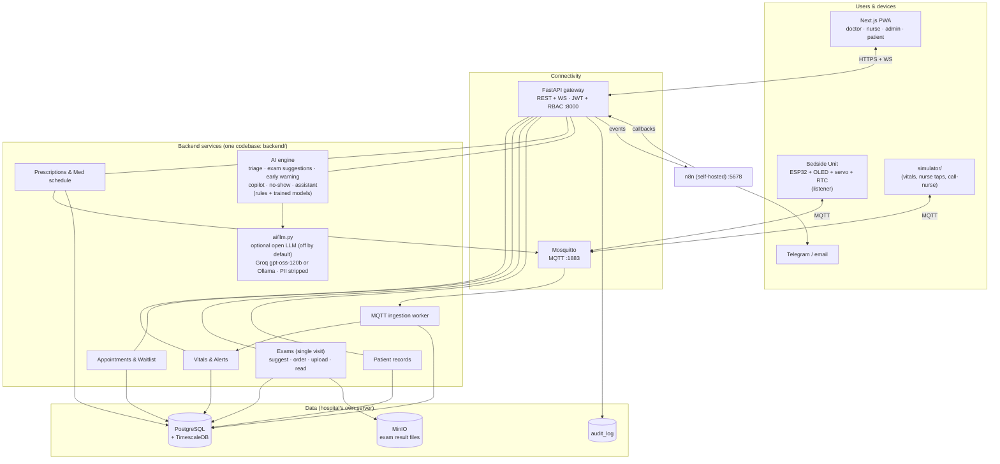
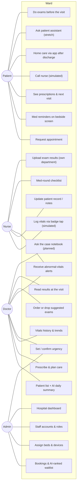
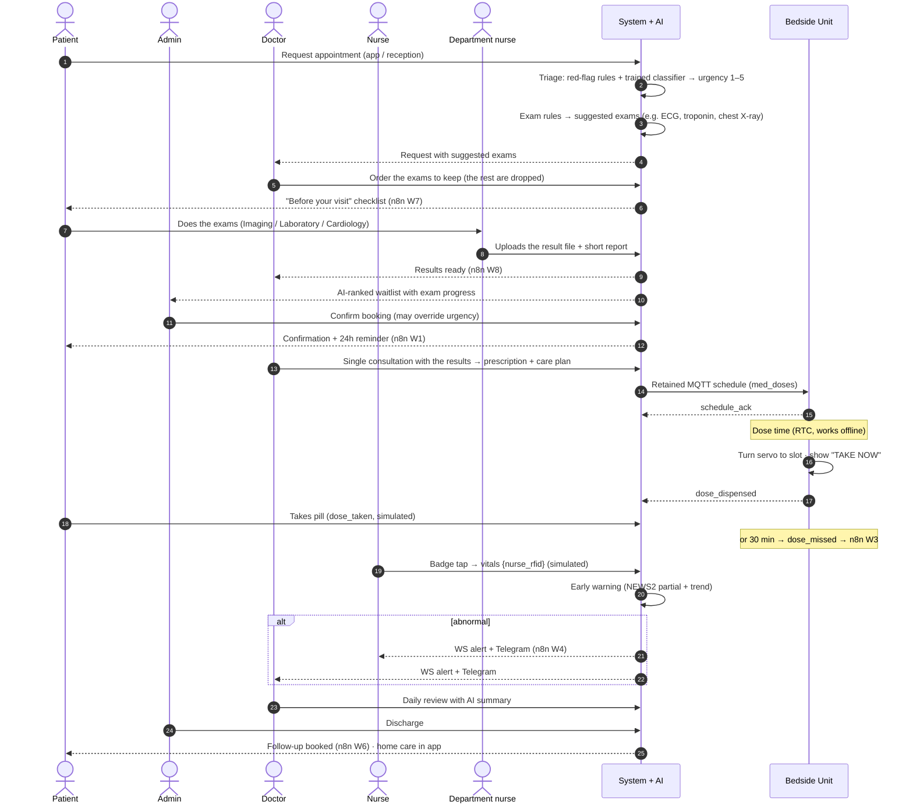
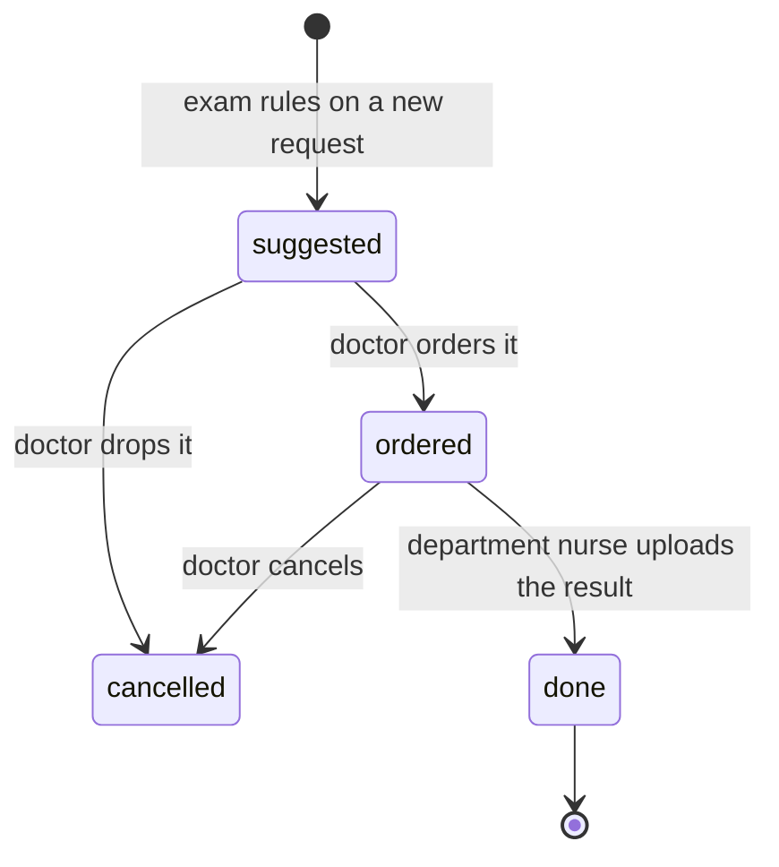
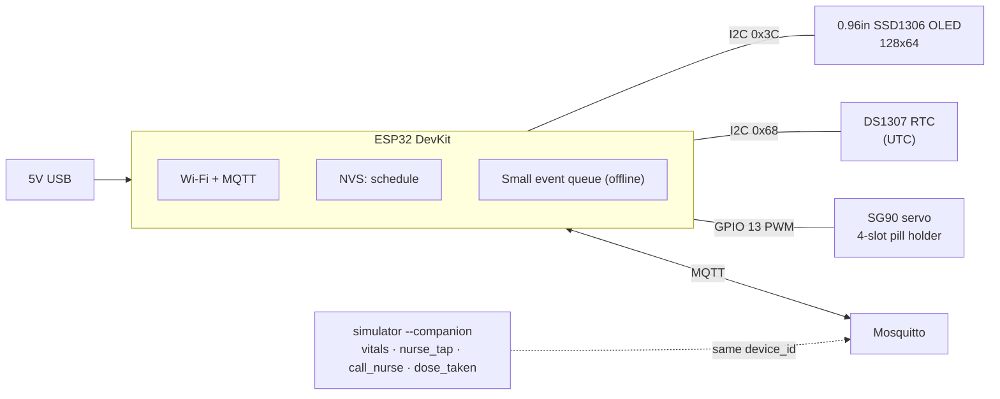
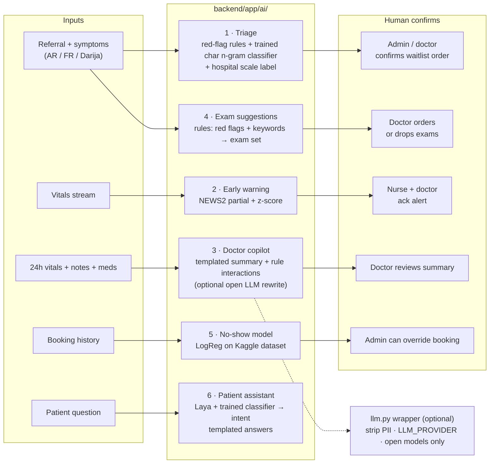

# Ward — Architecture

> Ward (وَرد) is "rose" in Arabic and a "hospital ward" in English. It is a connected smart-hospital ecosystem
> in which patient, nurse, doctor and administration share one patient record and the patient process is automated.

## 1. Problem and framing

Tunisian hospitals today:
- Patients who need care fast often get appointments 6–12 months away.
- A patient usually sees the doctor twice: a first visit to be told which exams to do, a second one with the results for the diagnosis and treatment.
- Doctors and nurses log, search and re-read paper records every day.
- Patient, nurse, doctor and administration have no shared system.

**Ward automates the patient process**:
- no paper
- exams done before the visit, so one consultation is enough
- fewer no-shows
- urgency-aware booking
- automatic follow-ups

Shorter waits are the *result*. We do not claim to "solve the waitlist".

**Where Ward fits.** Doctors we showed the demo to (2026-10-09) already use a doctor-only system, and the national
programme is rolling out:
- electronic records and PACS imaging in public hospitals
- Sahetna.tn for citizens, keyed on the national health identifier (INS)

Ward does not replace these. It connects the four roles around one patient and automates the steps between them; in
production it would use the INS as the patient identifier and exchange records with these systems.

**Locked principles:**
- **Human in the loop:** AI suggests and a human confirms.
- **Privacy:** self-hosted, RBAC, an audit log of every read, and no patient data leaves the server unless an optional open LLM is switched on, and then it is anonymized (Tunisian Organic Law 2004-63 / INPDP).
- **Prototype honesty:** vitals are simulated (the bedside unit has no sensors) and the AI is not clinically validated.
- **Data:** synthetic only.

## 2. System architecture

**Containers** (`infra/docker-compose.yml`): `db` (timescale/timescaledb, pg16), `mqtt` (eclipse-mosquitto 2), `minio`, `n8n`, `api` (FastAPI), `worker` (same image, runs `python -m app.iot.worker`), `web` (Next.js).

## 3. Users and use cases

All four roles share **one patient record** and see only what their permissions allow (matrix in `contracts/data-model.md`).

**Role owners** (each is responsible for their role's flow end-to-end in the demo): Patient → Hedi · Nurse → Wali · Doctor + Admin → Faouzi.

## 4. Patient journey (swimlane)

**Golden demo path:** the journey above, plus a **simulated abnormal vital** that fires an alert on the dashboard and on Telegram.

## 5. Single-visit pathway (exams before the visit)

Built from the doctors' feedback of 2026-10-09. Design: `docs/superpowers/specs/2026-10-09-single-visit-and-case-notebook-design.md`.

- **Suggestions are rules, not a model.**
  - `backend/app/ai/rules/exam_bundles.v1.json` maps red flags and keywords (French, English, Arabic) to exam sets, at most 4 per request. Example: chest pain gives ECG, troponin and a chest X-ray.
  - Rows are stored with `ai_suggested.source = "rules"`.
  - The sets are illustrative, for the hospital's doctors to review.
- **A doctor orders.** Only a doctor moves an exam from `suggested` to `ordered` (`human_confirmed_by`). Unticked suggestions are dropped. Any other transition is a 409 `bad_status`.
- **The performing department uploads.**
  - A nurse whose ward is the exam's `department` (Imaging, Laboratory or Cardiology) sees it in the **Exams** worklist.
  - The nurse uploads a PDF, JPEG or PNG of at most 15 MB, plus a short report line.
  - The file goes to MinIO under `exams/{exam}/{result}/{name}`.
- **Who sees what:**
  - **Doctor and nurse:** they read results and open files through `GET /exam-results/{id}/file`, which is audited and sent with `nosniff`.
  - **Admin:** status only.
  - **Patient:** ordered and done exams only. Never suggestions, AI fields or files.
- **Events:** `exam.ordered` (n8n W7, tells the patient where to go) and `exam.results_ready` (W8, tells the ordering doctor, once, when the last exam is done).
- **Booking:** staff still pick the slot. The waitlist shows "Exams 2/3" so they can book once the results are in.
- **Triage scale label:** our urgency 1–5 is shown with the hospital's triage-scale level from `rules/triage_scale.v1.json`, e.g. "Tri 1 · FRENCH". It is marked "(to confirm)" until the doctors confirm which scale they use.
- **Out of scope:** AI reading images or lab values, and a DICOM viewer. PACS integration is the production path.

## 6. Hardware: Smart Bedside Unit (listener: OLED + servo + RTC)

The bedside unit is a **listener**. It receives the schedule and commands, shows them, turns a servo to the dose's
pill slot and acknowledges. It has **no vital-sign sensors**: vitals, nurse taps and call-nurse come from
`simulator/`, which can run next to the device on the same `device_id` (`--companion`). The firmware is developed in
**Wokwi** (virtual ESP32, `firmware/diagram.json`) and is the last piece built; the same code flashes to a real board.

- OLED and RTC share I2C (distinct addresses). The final pin assignment lives in `firmware/PINMAP.md`.
- **Servo dispenser:** slot 0 = 0° (home), slots 1–4 = 45°, 90°, 135°, 180°. A dose with `slot: null` is reminder-only.

**Device screens (OLED):**
- **Home:** first name, clock, next dose, online/offline icon.
- **Dose reminder:** "TAKE NOW" + meds, blinking.
- **Alert banner** (inverted screen, 5 s) and **message toast**, from `command`.
- **Status:** "Syncing time…", "Not assigned".

**Dose flow:**
1. At dose time (or on `dispense_now`), turn the servo to the dose's `slot` → `dose_dispensed`, and show the reminder.
2. The simulator (`--companion`) answers with `dose_taken {method:"button"}`; the device sees it on its own `events` topic, homes the servo and returns to the home screen.
3. After 30 min with no `dose_taken` → `dose_missed` → the backend sends it to n8n W3.

**Offline:**
- The schedule lives in NVS, and reminders fire from the DS1307 RTC, so a reboot with no Wi-Fi still knows the time. NTP only sets the RTC when Wi-Fi is up.
- Up to 8 pending events are queued in RAM and sent on reconnect; the server deduplicates on `msg_id`.
- An MQTT last-will reports offline status.

## 7. AI layer (human in the loop)

| # | Module | Owner | Without the model or LLM |
|---|---|---|---|
| 1 | Triage | Faouzi | Red-flag rules alone (`source: "rules"`); with the trained model, `source: "model"` |
| 2 | Early warning | Wali | Pure rules, so it is its own fallback |
| 3 | Doctor copilot | Faouzi | Templated summary from min/max/latest vitals + the curated interaction list (this is the default; an open LLM only rewrites it when `LLM_PROVIDER` is set) |
| 4 | Exam suggestions | Faouzi | Pure rules (`source: "rules"`), so it is its own fallback |
| 5 | No-show model | Hedi | Base rate (≈0.20) |
| 6 | Patient assistant | Faouzi | Keyword intent rules, then the same templated answers from the DB; otherwise "Please ask your nurse" |

**How the modules decide:**
- **Triage:** urgency = max(red-flag floor, trained classifier, 2 if age ≥ 75). The model can raise urgency above the floor, never lower it.
- **Assistant:** a red-flag question gets the URGENT message with no model call. Otherwise the intent is the average of Laya (base model, zero-shot, optional install) and a trained char n-gram classifier. Low confidence means "ask staff". The answer is a template filled from the caller's own record.
- **Copilot:** the summary and the interaction list come from templates and a curated rule file.
  - The summary is cached 10 minutes and stored in `ai_summaries`. The doctor marks it reviewed, or undoes that.
  - An optional open LLM may rewrite the text. Our setup is Groq with `openai/gpt-oss-120b`, an open-weight model; Ollama works for fully local use. If the call fails, the template text is served (`source: "rules"`).
- **Exam suggestions:** red-flag ids from triage plus keywords in three languages pick exam bundles, at most 4 exams. The doctor orders or drops each one (section 5).
- **Early warning and no-show:** unchanged (Wali and Hedi).
- **Case notebook (planned):** see `docs/superpowers/plans/2026-10-09-case-notebook.md`.
  - The doctor asks questions about one patient. Answers come only from that patient's record (notes, exam reports, prescriptions, vitals summary, referral) and cite their sources.
  - Without an LLM it returns the best-matching passages (BM25). With an LLM it writes a short answer that may cite only those passages; anything else falls back.

**Measured on hand-written sets (synthetic, small):**

| Model | Eval set | Result |
|---|---|---|
| Triage classifier alone | 29 referrals | exact 0.897, within one 1.0, under-triaged 2, urgent missed 1 |
| Triage rules + model | same 29 | exact 0.897, within one 1.0, under-triaged 2, urgent missed 1 |
| Intent: classifier argmax | 36 questions | accuracy 0.722 (26/36) |
| Intent: classifier + 0.4 confidence threshold, red flags first (the Docker default, no Laya) | same 36 | accuracy 0.611 (22/36) |
| Intent: base Laya argmax | same 36 | accuracy 0.694 (25/36), median 139 ms on a laptop CPU |
| Intent: average of both, argmax | same 36 | accuracy 0.750 (27/36) |
| Intent: average of both + 0.4 threshold, red flags first | same 36 | accuracy 0.694 (25/36) |

The Docker image runs without Laya unless `requirements-laya.txt` is installed, so the default deployment is the classifier row with the 0.4 threshold (0.611): about four questions in ten fall to "ask your nurse" or the wrong template. On 2026-10-06 the evaluation sets were rewritten to remove leakage into the training data (a test now guards this), which is why these numbers are lower than earlier ones. A Laya fine-tuned head was tried before the fix (0.694 on the old set) and is not shipped. The one urgent-missed triage case is a Darija chest/faint complaint scored 4 instead of 5, and no keyword rule covers it. Sources: `backend/app/ai/models/*metrics.json`. These sets are tiny; read them as a sanity check, not a validation.

**Rules for every module:**
- Every module works with no LLM. A trained model is optional too: without its file the module drops to rules.
- Models are trained only on synthetic data (`backend/app/ai/data/`, scripts in `backend/app/ai/training/`).
- Any optional LLM call goes through `backend/app/ai/llm.py` (open models only).
- Every output is stored with `ai_suggested` + `human_confirmed_by`.
- Prompts and red-flag lists are versioned files in `backend/app/ai/prompts/` and `backend/app/ai/rules/`.

**Early-warning thresholds** (NEWS2 partial, single-parameter bands; **verify against the official RCP NEWS2 chart before the demo**):

| Parameter | 3 | 2 | 1 | 0 | 1 | 2 | 3 |
|---|---|---|---|---|---|---|---|
| Heart rate (bpm) | ≤40 | | 41–50 | 51–90 | 91–110 | 111–130 | ≥131 |
| SpO2 scale 1 (%) | ≤91 | 92–93 | 94–95 | ≥96 | | | |
| Temperature (°C) | ≤35.0 | | 35.1–36.0 | 36.1–38.0 | 38.1–39.0 | ≥39.1 | |

Partial score → severity:
- 0 → none
- 1–2 → low
- 3–4 → medium
- any single parameter = 3 → high
- ≥5 → high
- ≥7 → critical

**Trend:** a rolling z-score over the patient's last 30 readings; |z| ≥ 3 on HR or SpO2 raises a `trend` alert (medium).

## 8. Data and privacy

- Everything runs from one `docker compose` on the hospital's server.
- RBAC is enforced in FastAPI dependencies.
  - Every read of a patient record appends an `audit_log` row: records, vitals, doses, exams, result files, AI summaries and assistant questions.
  - Postgres RLS is the Day 4 stretch / production plan.
- Exam result files live in MinIO and are never exposed by a public link. The API checks the role and the department or ward, logs the read, then streams the file.
- No data leaves the server unless `LLM_PROVIDER` is set (default `none`).
  - When it is set, `llm.py` first replaces names, phone numbers and IDs with placeholders.
  - `LLM_PROVIDER=local` sends nothing off the machine (Ollama).
  - `groq` calls the Groq API with an open-weight model (`openai/gpt-oss-120b`).
  - Only the doctor's summary text uses it today. Tests always run with `LLM_PROVIDER=none`.
- Laya, when installed, runs locally on the CPU; its weights are downloaded once from the Hugging Face Hub. `snapshot_download` contacts the Hub on each process start (metadata only), so set `HF_HUB_OFFLINE=1` after the first download.
- Seed data is synthetic (`backend/app/seed.py`).
  - Staff: one doctor, a Cardiology nurse, an Internal Medicine nurse, an Imaging nurse and a Laboratory nurse, plus one admin.
  - 12 patients, of whom one is admitted with 48 h of vitals and one prescription.
  - 10 appointment requests with their suggested exams.
  - `python -m app.seed` is safe to re-run: on an existing database it only adds missing staff accounts.
