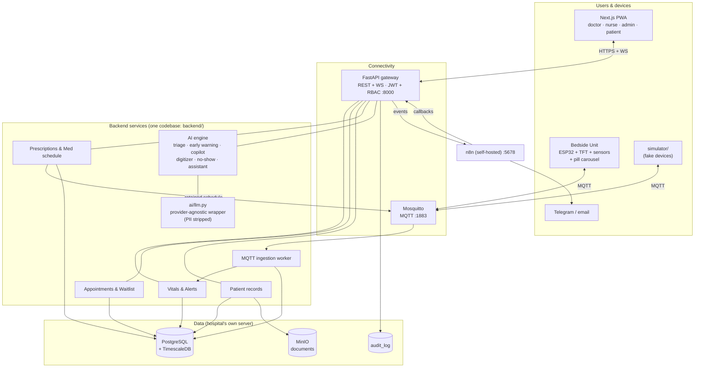
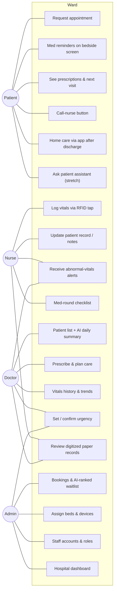
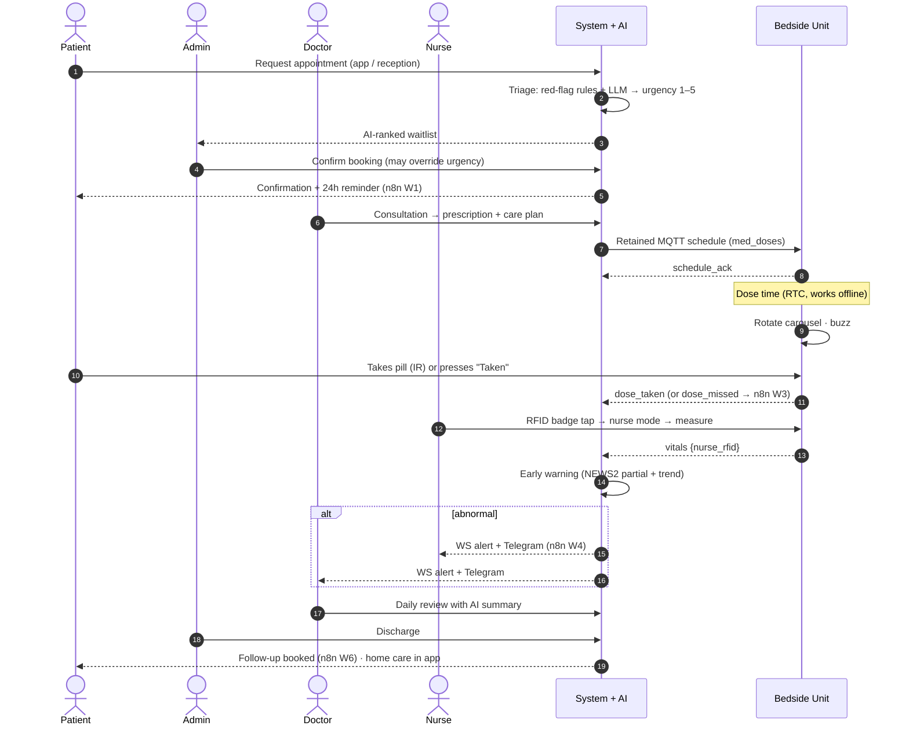
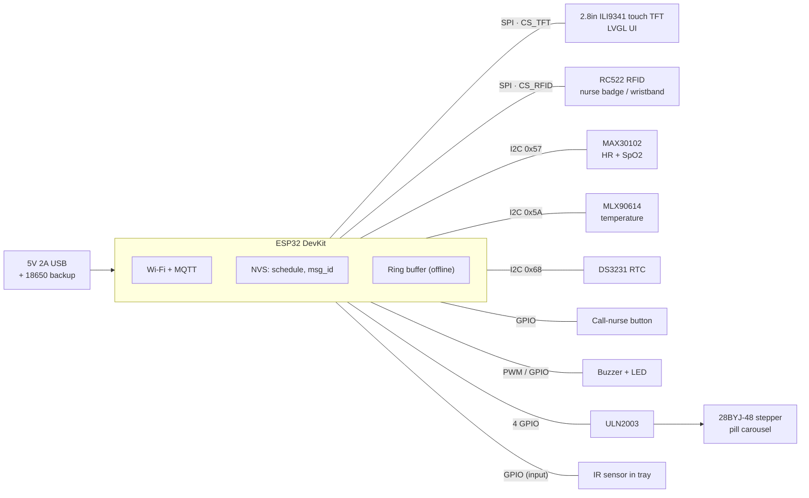
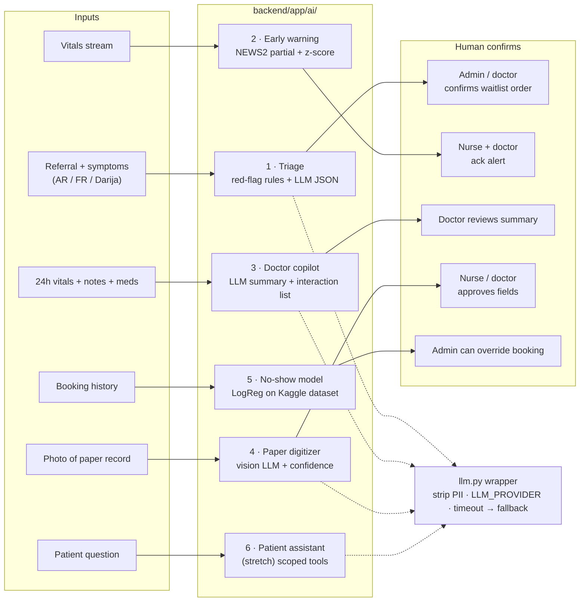

# Ward — Architecture

> Ward (وَرد) is "rose" in Arabic and a "hospital ward" in English. It is a connected smart-hospital ecosystem
> in which patient, nurse, doctor and administration share one patient record and the patient process is automated.

## 1. Problem and framing

Tunisian hospitals today:
- Patients who need care fast often get appointments 6–12 months away.
- Doctors and nurses log, search and re-read paper records every day.
- Patient, nurse, doctor and administration have no shared system.

**Ward automates the patient process**: no paper, fewer no-shows, urgency-aware booking and automatic follow-ups.
Shorter waits are the *result*. We do not claim to "solve the waitlist".

**Locked principles:**
- **Human in the loop:** AI suggests and a human confirms.
- **Privacy:** self-hosted, RBAC, an audit log of every read, and anonymized cloud LLM calls (Tunisian Organic Law 2004-63 / INPDP).
- **Prototype honesty:** sensors are not medical-grade and the AI is not clinically validated.
- **Data:** synthetic only.

## 2. System architecture

**Containers** (`infra/docker-compose.yml`): `db` (timescale/timescaledb, pg16), `mqtt` (eclipse-mosquitto 2), `minio`, `n8n`, `api` (FastAPI), `worker` (same image, runs `python -m app.iot.worker`), `web` (Next.js).

## 3. Users and use cases

All four roles share **one patient record** and see only what their permissions allow (matrix in `contracts/data-model.md`).

**Role owners** (each is responsible for their role's flow end-to-end in the demo): Patient → Hedi · Nurse → Wali · Doctor + Admin → Faouzi.

## 4. Patient journey (swimlane)

**Golden demo path:** the journey above, plus a live **paper digitizer** moment and a **simulated abnormal vital** that fires an alert on the dashboard and on Telegram.

## 5. Hardware: Smart Bedside Unit with pill carousel (Option A)

- TFT, touch and RC522 share SPI with separate CS pins. MAX30102, MLX90614 and DS3231 share I2C (distinct addresses).
- GPIO 34–39 are input-only, so they suit the IR sensor and the button, never the stepper.
- The final pin assignment lives in `firmware/PINMAP.md` (Hedi + Wali, Day 1).
- **Carousel:** a store-bought round rotating pill organizer (or a foam-board build) sits on the stepper over a base with one drop hole. The IR sensor in the tray detects that the pill was removed.

**Device screens:**
- **Home:** first name, clock, next dose, online/offline icon.
- **Dose reminder:** full screen + buzzer + "Taken".
- **Measure:** "place finger".
- **Call-nurse confirmation.**
- **Nurse mode** (after an RFID tap): shows the patient; vitals are tagged with the nurse.

**Dose flow (Option A):**
1. At dose time, rotate to the dose's `slot` → `dose_dispensed`.
2. Buzz.
3. Wait for IR pickup or the "Taken" button → `dose_taken {method}`.
4. After 30 min with no pickup → `dose_missed` → the backend sends it to n8n W3.

**Offline:**
- The schedule lives in NVS and reminders fire from the RTC.
- Vitals and events go into a 128-entry ring buffer with RTC timestamps and are replayed on reconnect; the server deduplicates on `msg_id`.
- An MQTT last-will reports offline status.

**Fallback (go/no-go end of Day 2):** if the carousel is unreliable, skip the rotation and keep the "Taken" button. The MQTT events stay identical.

## 6. AI layer (human in the loop)

| # | Module | Owner | Deterministic fallback |
|---|---|---|---|
| 1 | Triage | Faouzi | Red-flag rule list + keyword score → urgency |
| 2 | Early warning | Wali | Pure rules, so it is its own fallback |
| 3 | Doctor copilot | Faouzi | Templated summary from min/max/latest vitals + the curated interaction list |
| 4 | Paper digitizer | Faouzi | Pre-baked extraction for `demo_record.jpg` |
| 5 | No-show model | Hedi | Base rate (≈0.20) |
| 6 | Patient assistant (stretch) | Faouzi | "Please ask your nurse" + next dose / next visit from the DB |

**Rules for every module:**
- All LLM calls go through `backend/app/ai/llm.py`.
- Every output is stored with `ai_suggested` + `human_confirmed_by`.
- Prompts and red-flag lists are versioned files in `backend/app/ai/prompts/` and `backend/app/ai/rules/`.

**Early-warning thresholds** (NEWS2 partial, single-parameter bands; **verify against the official RCP NEWS2 chart before the demo**):

| Parameter | 3 | 2 | 1 | 0 | 1 | 2 | 3 |
|---|---|---|---|---|---|---|---|
| Heart rate (bpm) | ≤40 | | 41–50 | 51–90 | 91–110 | 111–130 | ≥131 |
| SpO2 scale 1 (%) | ≤91 | 92–93 | 94–95 | ≥96 | | | |
| Temperature (°C) | ≤35.0 | | 35.1–36.0 | 36.1–38.0 | 38.1–39.0 | ≥39.1 | |

Partial score → severity:
- 0 → none
- 1–2 → low
- 3–4 → medium
- any single parameter = 3 → high
- ≥5 → high
- ≥7 → critical

**Trend:** a rolling z-score over the patient's last 30 readings; |z| ≥ 3 on HR or SpO2 raises a `trend` alert (medium).

## 7. Data and privacy

- Everything runs from one `docker compose` on the hospital's server.
- RBAC is enforced in FastAPI dependencies. Every read of a patient record appends an `audit_log` row. Postgres RLS is the Day 4 stretch / production plan.
- `llm.py` replaces names, phone numbers and IDs with placeholders before any cloud call. `LLM_PROVIDER=local` routes to a local model (e.g. Ollama) instead.
- Seed data is synthetic (`backend/app/seed.py`).
