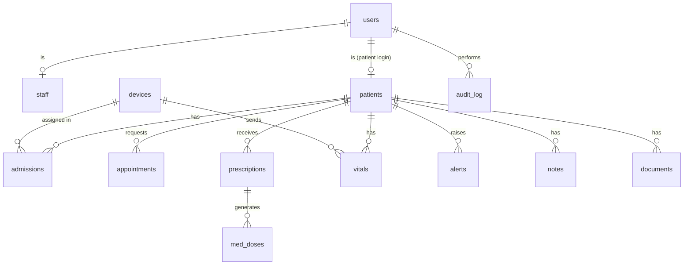

# Data model — v1.0

> **Version:** 1.0 (frozen 2026-10-05) · **Owner:** Wali (schema + migrations); everyone reviews
> Any change: open a PR that bumps the version above, add a changelog line, and announce it in the team chat. Schema changes ship as Alembic migrations only.

PostgreSQL 16 + TimescaleDB. IDs are prefixed text (`p-0001`) generated by the backend from per-table sequences (`id_prefix || lpad(nextval(seq)::text, n, '0')`). All timestamps are `timestamptz` (UTC).

## Entity diagram

## Tables

### `users`
| Column | Type | Notes |
|---|---|---|
| `id` | text PK | `u-0001` |
| `email` | text unique | |
| `password_hash` | text | bcrypt |
| `name` | text | |
| `role` | text | `doctor` \| `nurse` \| `admin` \| `patient` |
| `patient_id` | text FK → patients, null | set only for the patient role |
| `created_at` | timestamptz | |

### `staff`
| Column | Type | Notes |
|---|---|---|
| `user_id` | text PK FK → users | |
| `ward` | text | e.g. `Cardiology` (nurse scope) |
| `rfid_uid` | text unique, null | nurse badge UID, uppercase hex |
| `telegram_chat_id` | text, null | for n8n W4 |

### `patients`
| Column | Type | Notes |
|---|---|---|
| `id` | text PK | `p-0001` |
| `first_name`, `last_name` | text | synthetic only |
| `date_of_birth` | date | |
| `sex` | text | `F` \| `M` |
| `phone`, `email` | text, null | for reminders (synthetic) |
| `telegram_chat_id` | text, null | |
| `ward` | text, null | |
| `allergies` | jsonb | `["penicillin"]` |
| `history` | text | |
| `attending_doctor_id` | text FK → users, null | defines "doctor's own patients" |
| `wristband_rfid` | text unique, null | |
| `created_at` | timestamptz | |

### `devices`
| Column | Type | Notes |
|---|---|---|
| `id` | text PK | `bsu-001` |
| `fw_version` | text | |
| `online` | bool | from `status` |
| `last_seen` | timestamptz | |
| `schedule_version` | int | last version published |
| `schedule_acked_version` | int | from `schedule_ack` |
| `last_msg_id` | bigint | highest `msg_id` seen (diagnostics only; dedupe uses `ingested_messages`) |

### `admissions`
| Column | Type | Notes |
|---|---|---|
| `id` | text PK | `adm-0001` |
| `patient_id` | text FK | |
| `device_id` | text FK, null | one active admission per device |
| `bed` | text | `C-12` |
| `admitted_at`, `discharged_at` | timestamptz | `discharged_at` null = active |

Partial unique indexes: one active admission per `patient_id` and per `device_id` (`WHERE discharged_at IS NULL`).

### `appointments`
| Column | Type | Notes |
|---|---|---|
| `id` | text PK | `a-0001` |
| `patient_id` | text FK | |
| `status` | text | `requested` \| `confirmed` \| `cancelled` \| `done` \| `no_show` |
| `referral_text` | text | |
| `symptoms` | jsonb | |
| `urgency_ai` | int 1–5 | |
| `urgency_final` | int 1–5, null | human override |
| `ai_suggested` | jsonb | full triage output `{urgency,reasons,red_flags,source}` |
| `human_confirmed_by` | text FK → users, null | same as `confirmed_by`; kept for the AI-audit convention |
| `confirmed_by` | text FK → users, null | |
| `doctor_id` | text FK → users, null | |
| `slot_at` | timestamptz, null | |
| `no_show_prob` | float, null | from the no-show model |
| `patient_confirmed_at` | timestamptz, null | patient answered the W1 reminder with "confirm" |
| `created_at` | timestamptz | |

### `prescriptions`
| Column | Type | Notes |
|---|---|---|
| `id` | text PK | `rx-0001` |
| `patient_id`, `doctor_id` | text FK | |
| `items` | jsonb | `[{med, times[], slot, days}]` |
| `care_plan` | text | |
| `active` | bool | |
| `created_at` | timestamptz | |

### `med_doses`
| Column | Type | Notes |
|---|---|---|
| `id` | text PK | `d-000001` |
| `prescription_id`, `patient_id` | text FK | |
| `scheduled_at` | timestamptz | one row per dose occurrence (`days` × `times`) |
| `time_of_day` | text `HH:MM` | what goes into the MQTT schedule |
| `meds` | jsonb | |
| `slot` | int, null | carousel slot |
| `status` | text | `scheduled` \| `dispensed` \| `taken` \| `missed` |
| `taken_method` | text, null | `ir` \| `button` |
| `updated_at` | timestamptz | |

The MQTT `schedule` sends one entry per distinct `(time_of_day, slot)` of the active prescriptions, using the `dose_id` of **today's** occurrence. When an event arrives, the backend matches `dose_id` to update the row.

### `vitals` (TimescaleDB hypertable on `ts`)
| Column | Type | Notes |
|---|---|---|
| `ts` | timestamptz | from the device RTC |
| `device_id` | text | |
| `patient_id` | text, null | |
| `hr` | int, null | |
| `spo2` | int, null | |
| `temp` | real, null | |
| `nurse_id` | text FK → users, null | resolved from `nurse_rfid` via `staff.rfid_uid` |
| `news2` | int, null | partial score computed on ingest |
| `source` | text | `device` \| `simulator` \| `manual` |

Index `(patient_id, ts DESC)`.

### `ingested_messages`
`(device_id text, msg_id bigint, received_at timestamptz, PRIMARY KEY (device_id, msg_id))`. The worker does `INSERT … ON CONFLICT DO NOTHING` and skips the message if no row was inserted.

### `alerts`
| Column | Type | Notes |
|---|---|---|
| `id` | text PK | `al-0001` |
| `patient_id`, `device_id` | text, null | |
| `kind` | text | `news2` \| `trend` \| `call_nurse` \| `dose_missed` \| `device_offline` |
| `severity` | text | `low` \| `medium` \| `high` \| `critical` |
| `news2` | int, null | |
| `message` | text | |
| `ai_suggested` | jsonb, null | the early-warning output that triggered it |
| `created_at` | timestamptz | |
| `acked_by` | text FK → users, null | acts as `human_confirmed_by` for alerts |
| `acked_at` | timestamptz, null | |

### `notes`
`id text PK (n-0001)`, `patient_id`, `author_id`, `text`, `created_at`.

### `documents`
| Column | Type | Notes |
|---|---|---|
| `id` | text PK | `doc-0001` |
| `patient_id` | text FK | |
| `minio_key` | text | `documents/{patient_id}/{doc_id}.jpg` in bucket `ward-docs` |
| `kind` | text | `paper_record` \| `report` \| `scan` |
| `ai_suggested` | jsonb | `{fields:{name:{value,confidence}}, source}` |
| `approved_fields` | jsonb, null | what the human saved |
| `human_confirmed_by` | text FK → users, null | |
| `created_at` | timestamptz | |

### `ai_summaries`
`id`, `patient_id`, `ai_suggested jsonb` (`{summary, interactions, source}`), `human_confirmed_by` (doctor who marked it reviewed, null), `created_at`.

### `audit_log`
| Column | Type | Notes |
|---|---|---|
| `id` | bigserial PK | |
| `ts` | timestamptz | |
| `user_id` | text | |
| `role` | text | |
| `action` | text | `read` \| `create` \| `update` \| `delete` \| `login` |
| `resource` | text | e.g. `patient`, `vitals`, `prescription` |
| `resource_id` | text | |
| `patient_id` | text, null | |
| `ip` | text | |

Append-only: the app DB role has `INSERT, SELECT` only on this table.

## AI-output convention (locked)

Every row that stores an AI output has `ai_suggested jsonb` (the raw suggestion including `source: "llm"|"fallback"`) and a confirmer column (`human_confirmed_by`, or `acked_by` for alerts). The UI must show "AI suggestion — needs confirmation" while the confirmer is null.

## Role permission matrix

R = read, W = write, — = no access. "own" = `patients.attending_doctor_id = me`; "ward" = `patients.ward = staff.ward`; "self" = `users.patient_id`.

| Resource | Doctor | Nurse | Admin | Patient |
|---|---|---|---|---|
| Patient demographics | RW own | R ward | R (name, bed, device only) | R self |
| Allergies / history | RW own | RW ward | — | R self |
| Vitals | R own | RW ward | — | R self |
| Notes | RW own | RW ward | — | — |
| Prescriptions | RW own | R ward | — | R self |
| Med doses | R own | RW ward (mark given) | — | R self |
| Alerts | RW own (ack) | RW ward (ack) | — | — |
| Appointments | RW own | — | RW all | RW self (request/cancel) |
| Documents / digitizer | RW own | RW ward | — | — |
| Devices / admissions | R | R | RW | — |
| Users / staff | — | — | RW | — |
| Audit log | — | — | R | — |

Enforcement: FastAPI dependencies (`require_role`, `require_patient_access`) are the primary layer. PostgreSQL row-level security on `patients`, `vitals` and `notes` is a **Day 4 stretch**; mention it in the pitch as the production plan if it isn't done.

## Seed data (synthetic)

`backend/app/seed.py` creates:
- 1 doctor (`u-0001`, Cardiology), 2 nurses (`u-0002` with RFID `04A1B2C3`, `u-0003`), 1 admin (`u-0004`), 1 patient login (`u-0005` → `p-0001`) and the n8n service account (`u-0006`, role admin)
- 12 patients: `p-0001`…`p-0006` in Cardiology (attending doctor `u-0001`, nurse `u-0002`'s ward), `p-0007`…`p-0012` in Internal Medicine (nurse `u-0003`'s ward, no attending doctor from the seed). `p-0001` (Amira) is admitted to bed `C-12` on device `bsu-001`
- 48 h of normal vitals for admitted patients
- 1 active prescription for `p-0001`
- 10 appointment requests with mixed urgency
- 1 sample handwritten record image in `backend/app/ai/assets/demo_record.jpg`

## Changelog

- **1.0** (2026-10-05): initial freeze. Adds `ingested_messages`, `ai_summaries`, `staff.rfid_uid`, the schedule-version columns and the AI-output convention.
