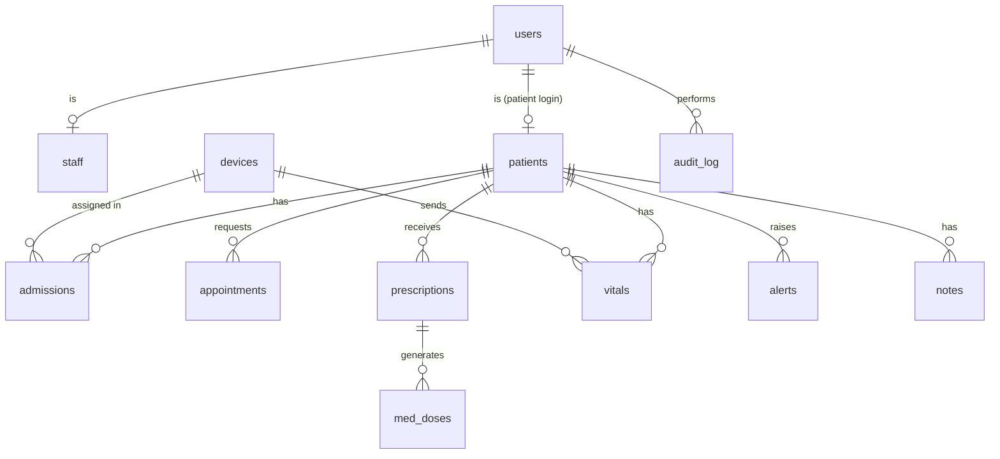

# Data model — v1.0

> **Version:** 1.7 (2026-10-10) · **Owner:** Wali (schema + migrations); everyone reviews
> Any change: open a PR that bumps the version above, add a changelog line, and announce it in the team chat. Schema changes ship as Alembic migrations only.

PostgreSQL 16 + TimescaleDB. IDs are prefixed text (`p-0001`) generated by the backend from per-table sequences (`id_prefix || lpad(nextval(seq)::text, n, '0')`). All timestamps are `timestamptz` (UTC).

## Entity diagram

## Tables

### `users`
| Column | Type | Notes |
|---|---|---|
| `id` | text PK | `u-0001` |
| `email` | text unique | |
| `password_hash` | text | bcrypt |
| `name` | text | |
| `role` | text, null | `doctor` \| `nurse` \| `admin` \| `patient`; null while a staff account is pending (1.5) |
| `patient_id` | text FK → patients, null | set only for the patient role |
| `status` | text, not null, default `active` | `pending` \| `active` \| `disabled` \| `rejected` (1.5). Only `active` users can use a token. |
| `failed_logins` | int, default 0 | (1.5) consecutive wrong passwords; 5 locks the account |
| `locked_until` | timestamptz, null | (1.5) set for 15 min after 5 failures |
| `approved_by`, `approved_at` | text FK → users, null · timestamptz, null | (1.5) the approver and time |
| `requested_note` | text, null | (1.5) what the person typed at sign-up, e.g. "nurse, Cardiology" (information only) |
| `requested_role` | text, null | (1.5) `patient` \| `nurse` \| `doctor`: the role picked on the sign-up form. A request only; the approver sets `role`. |
| `requested_doctor_id` | text FK → users, null | (1.5) the doctor chosen at sign-up ("I work with Dr ..."); decides which doctor sees the pending request (patients and nurses only; a doctor request has none) |
| `status_changed_by` | text FK → users, null | (1.5) who last disabled or rejected the account; null while active and for rows disabled before this column existed. A doctor may only enable or approve what a non-admin decided; null counts as an admin's decision. |
| `created_at` | timestamptz | |

### `staff`
| Column | Type | Notes |
|---|---|---|
| `user_id` | text PK FK → users | |
| `ward` | text | e.g. `Cardiology` (nurse scope) |
| `rfid_uid` | text unique, null | nurse badge UID, uppercase hex |
| `supervisor_id` | text FK → users, null | (1.5) the doctor whose team this nurse belongs to; set when that doctor approves the account, or when the admin approves a nurse request that named him |
| `telegram_chat_id` | text, null | for n8n W4 |

### `access_codes` (1.5)
Password-reset codes (the first-admin bootstrap code is one too). Enrollment codes were removed before release: a patient account is linked to a record when it is approved.

| Column | Type | Notes |
|---|---|---|
| `id` | text PK | `ac-0001` |
| `purpose` | text | `reset` (set a new password) |
| `code_hash` | text | sha256 of the code. The plain code is shown once to the issuer and never stored. |
| `user_id` | text FK → users, null | the user the code is for |
| `issued_by` | text FK → users | |
| `created_at`, `expires_at` | timestamptz | default lifetime 48 h |
| `used_at`, `used_by` | timestamptz, null · text FK → users, null | single use |

Issuing a new code for the same user revokes the previous unused one by setting its `expires_at` to now.

### `patient_access` (1.5)
A doctor shares a patient with another doctor.

| Column | Type | Notes |
|---|---|---|
| `id` | text PK | `pa-0001` |
| `patient_id`, `user_id` | text FK | the doctor receiving access |
| `granted_by` | text FK → users | must be the attending doctor (or an admin) |
| `created_at`, `expires_at` | timestamptz | `expires_at` required; default 30 days, at most 1 year |
| `revoked_at` | timestamptz, null | |

### `patients`
| Column | Type | Notes |
|---|---|---|
| `id` | text PK | `p-0001` |
| `first_name`, `last_name` | text | synthetic only |
| `date_of_birth` | date | |
| `sex` | text | `F` \| `M` |
| `phone`, `email` | text, null | for reminders (synthetic) |
| `telegram_chat_id` | text, null | |
| `ward` | text, null | |
| `allergies` | jsonb | `["penicillin"]` |
| `history` | text | |
| `attending_doctor_id` | text FK → users, null | defines "doctor's own patients" |
| `wristband_rfid` | text unique, null | |
| `created_at` | timestamptz | |

### `devices`
| Column | Type | Notes |
|---|---|---|
| `id` | text PK | `bsu-001` |
| `fw_version` | text | |
| `online` | bool | from `status` |
| `last_seen` | timestamptz | |
| `schedule_version` | int | last version published |
| `schedule_acked_version` | int | from `schedule_ack` |
| `last_msg_id` | bigint | highest `msg_id` seen (diagnostics only; dedupe uses `ingested_messages`) |

### `admissions`
| Column | Type | Notes |
|---|---|---|
| `id` | text PK | `adm-0001` |
| `patient_id` | text FK | |
| `device_id` | text FK, null | one active admission per device |
| `bed` | text | `C-12` |
| `admitted_at`, `discharged_at` | timestamptz | `discharged_at` null = active |

Partial unique indexes: one active admission per `patient_id` and per `device_id` (`WHERE discharged_at IS NULL`).

### `appointments`
| Column | Type | Notes |
|---|---|---|
| `id` | text PK | `a-0001` |
| `patient_id` | text FK | |
| `status` | text | `requested` \| `confirmed` \| `cancelled` \| `done` \| `no_show` |
| `referral_text` | text | |
| `symptoms` | jsonb | |
| `urgency_ai` | int 1–5 | |
| `urgency_final` | int 1–5, null | human override |
| `ai_suggested` | jsonb | full triage output `{urgency,reasons,red_flags,source}` |
| `human_confirmed_by` | text FK → users, null | same as `confirmed_by`; kept for the AI-audit convention |
| `confirmed_by` | text FK → users, null | |
| `doctor_id` | text FK → users, null | |
| `slot_at` | timestamptz, null | |
| `no_show_prob` | float, null | from the no-show model |
| `patient_confirmed_at` | timestamptz, null | patient answered the W1 reminder with "confirm" |
| `created_at` | timestamptz | |

### `prescriptions`
| Column | Type | Notes |
|---|---|---|
| `id` | text PK | `rx-0001` |
| `patient_id`, `doctor_id` | text FK | |
| `items` | jsonb | `[{med, times[], slot, days}]` |
| `care_plan` | text | |
| `active` | bool | |
| `created_at` | timestamptz | |

### `med_doses`
| Column | Type | Notes |
|---|---|---|
| `id` | text PK | `d-000001` |
| `prescription_id`, `patient_id` | text FK | |
| `scheduled_at` | timestamptz | one row per dose occurrence (`days` × `times`) |
| `time_of_day` | text `HH:MM` | what goes into the MQTT schedule |
| `meds` | jsonb | |
| `slot` | int, null | carousel slot |
| `status` | text | `scheduled` \| `dispensed` \| `taken` \| `missed` |
| `taken_method` | text, null | `ir` \| `button` |
| `updated_at` | timestamptz | |

The MQTT `schedule` sends one entry per distinct `(time_of_day, slot)` of the active prescriptions, using the `dose_id` of **today's** occurrence. When an event arrives, the backend matches `dose_id` to update the row.

### `vitals` (TimescaleDB hypertable on `ts`)
| Column | Type | Notes |
|---|---|---|
| `ts` | timestamptz | from the device RTC |
| `device_id` | text | |
| `patient_id` | text, null | |
| `hr` | int, null | |
| `spo2` | int, null | |
| `temp` | real, null | |
| `nurse_id` | text FK → users, null | resolved from `nurse_rfid` via `staff.rfid_uid` |
| `news2` | int, null | partial score computed on ingest |
| `source` | text | `device` \| `simulator` \| `manual` |

Index `(patient_id, ts DESC)`.

### `ingested_messages`
`(device_id text, msg_id bigint, received_at timestamptz, PRIMARY KEY (device_id, msg_id))`. The worker does `INSERT … ON CONFLICT DO NOTHING` and skips the message if no row was inserted.

### `alerts`
| Column | Type | Notes |
|---|---|---|
| `id` | text PK | `al-0001` |
| `patient_id`, `device_id` | text, null | |
| `kind` | text | `news2` \| `trend` \| `call_nurse` \| `dose_missed` \| `device_offline` |
| `severity` | text | `low` \| `medium` \| `high` \| `critical` |
| `news2` | int, null | |
| `message` | text | |
| `ai_suggested` | jsonb, null | the early-warning output that triggered it |
| `created_at` | timestamptz | |
| `acked_by` | text FK → users, null | acts as `human_confirmed_by` for alerts |
| `acked_at` | timestamptz, null | |

### `notes`
`id text PK (n-0001)`, `patient_id`, `author_id`, `text`, `created_at`.

### `ai_summaries`
`id`, `patient_id`, `ai_suggested jsonb` (`{summary, interactions, source}`), `human_confirmed_by` (doctor who marked it reviewed, null), `created_at`.

### `exam_orders`
| Column | Type | Notes |
|---|---|---|
| `id` | text PK | `ex-0001` |
| `patient_id` | text FK | |
| `appointment_id` | text FK, null | the request the exam prepares |
| `code` | text | key in `app/ai/rules/exam_bundles.v1.json` → `catalogue` |
| `label` | text | e.g. "Chest X-ray" |
| `department` | text | performing department; matches `staff.ward` (`Imaging`, `Laboratory`, `Cardiology`) |
| `status` | text | `suggested` \| `ordered` \| `done` \| `cancelled` |
| `ai_suggested` | jsonb, null | `{source:"rules", bundles[], reason}`; null when a doctor added the exam by hand |
| `human_confirmed_by` | text FK → users, null | the doctor who ordered it |
| `ordered_at`, `done_at` | timestamptz, null | |
| `created_at` | timestamptz | |

### `exam_results`
| Column | Type | Notes |
|---|---|---|
| `id` | text PK | `er-0001` |
| `exam_order_id` | text FK | |
| `patient_id` | text FK | |
| `uploaded_by` | text FK → users | |
| `file_key` | text | MinIO key `exams/{exam_order_id}/{id}/{file_name}` |
| `file_name`, `content_type` | text | PDF, JPEG or PNG |
| `size_bytes` | int | ≤ 15 MB |
| `report_text` | text | short report typed at upload, default `''` |
| `created_at` | timestamptz | |

### `notebook_entries`
| Column | Type | Notes |
|---|---|---|
| `id` | text PK | `nb-0001` |
| `patient_id` | text FK | |
| `user_id` | text FK → users | who asked |
| `question` | text | |
| `ai_suggested` | jsonb | `{answer, citations[], source}` |
| `human_confirmed_by` | text FK → users, null | |
| `created_at` | timestamptz | |

### `audit_log`
| Column | Type | Notes |
|---|---|---|
| `id` | bigserial PK | |
| `ts` | timestamptz | |
| `user_id` | text | |
| `role` | text | |
| `action` | text | `read` \| `create` \| `update` \| `delete` \| `login` |
| `resource` | text | e.g. `patient`, `vitals`, `prescription` |
| `resource_id` | text | |
| `patient_id` | text, null | |
| `ip` | text | |

Append-only: the app DB role has `INSERT, SELECT` only on this table.

### `health_events` (1.6)

| Column | Type | Notes |
|---|---|---|
| `id` | text PK | `he-0001` (`new_id(db, "he")`) |
| `title` | jsonb | `{"en","fr","ar"}`, all three required |
| `description` | jsonb | `{"en","fr","ar"}`, may be empty strings |
| `category` | text | `screening` \| `vaccination` \| `chronic_disease` \| `infectious_disease` \| `lifestyle` \| `mental_health` \| `blood_donation` |
| `starts_on`, `ends_on` | date | inclusive; `ends_on >= starts_on` (single-day event: equal) |
| `audience` | jsonb | `{"roles": ["patient","nurse","doctor","admin"], "sex": "F"\|"M"\|null, "min_age": int\|null, "max_age": int\|null}` |
| `notify_days_before` | int | default 3, 0-30 |
| `source_url` | text, null | public page of the organiser |
| `organizer` | text, null | e.g. "ONFP", "Ministère de la Santé", "WHO" |
| `announced_at` | timestamptz, null | set when the push went out (W9 callback or Notify now); never pushed twice by the cron |
| `created_by` | text FK users, null | null for seeded rows |
| `created_at` | timestamptz | default now() |

Index on `starts_on`. Seed: 17 events `he-0001` ... `he-0017` (Oct 2026 to Sep 2027), inserted only if the id is missing so an admin edit is never overwritten.

### `health_event_prefs` (1.6)

| Column | Type | Notes |
|---|---|---|
| `user_id` | text FK users | PK part |
| `category` | text | PK part |
| `following` | bool | only `false` rows matter; no row = following |

## AI-output convention (locked)

Every row that stores an AI output has `ai_suggested jsonb` (the raw suggestion including `source: "model"|"rules"|"llm"`) and a confirmer column (`human_confirmed_by`, or `acked_by` for alerts). The UI must show "AI suggestion — needs confirmation" while the confirmer is null.

## Role permission matrix

R = read, W = write, — = no access. "own" = `patients.attending_doctor_id = me`; "ward" = `patients.ward = staff.ward`; "self" = `users.patient_id`.

| Resource | Doctor | Nurse | Admin | Patient |
|---|---|---|---|---|
| Patient demographics | RW own | R ward | R (name, bed, device only) | R self |
| Allergies / history | RW own | RW ward | — | R self |
| Vitals | R own | RW ward | — | R self |
| Notes | RW own | RW ward | — | — |
| Prescriptions | RW own | R ward | — | R self |
| Med doses | R own | RW ward (mark given) | — | R self |
| Alerts | RW own (ack) | RW ward (ack) | — | — |
| Appointments | RW own | — | RW all | RW self (request/cancel) |
| Exams | R own + any `requested` appointment; W order/cancel | R ward + own department; W upload (own department) | R status only | R self (ordered/done only) |
| Notebook | RW own | — | — | — |
| Devices / admissions | R | R | RW | — |
| Users / staff | — | — | RW | — |
| Audit log | — | — | R | — |

Accounts (1.5): nurse: own ward OR patients of her supervisor doctor; doctor: attending OR an unexpired, unrevoked `patient_access` grant.

Enforcement: FastAPI dependencies (`require_role`, `require_patient_access`) are the primary layer. PostgreSQL row-level security on `patients`, `vitals` and `notes` is a **Day 4 stretch**; mention it in the pitch as the production plan if it isn't done.

## Seed data (synthetic)

`backend/app/seed.py` creates:
- 1 doctor (`u-0001`, Cardiology), 2 nurses (`u-0002` with RFID `04A1B2C3`, `u-0003`), 1 admin (`u-0004`) and 1 patient login (`u-0005` → `p-0001`)
- 2 department nurses: `u-0006` Imaging (`imaging@ward.tn`), `u-0007` Laboratory (`lab@ward.tn`)
- 12 patients: `p-0001`…`p-0006` in Cardiology (attending doctor `u-0001`, nurse `u-0002`'s ward), `p-0007`…`p-0012` in Internal Medicine (nurse `u-0003`'s ward, no attending doctor from the seed). `p-0001` (Amira) is admitted to bed `C-12` on device `bsu-001`
- 48 h of normal vitals for admitted patients
- 1 active prescription for `p-0001`
- 10 appointment requests with mixed urgency

### chat_conversations, chat_messages (AI assistant page, migration 0006)

| Table | Columns |
|---|---|
| `chat_conversations` | `id` (`cv-0001`), `user_id` → users, `title`, `created_at`, `updated_at` |
| `chat_messages` | `id` (`cm-000001`), `conversation_id` → chat_conversations (cascade), `role` (`user`\|`assistant`), `text`, `patient_id` → patients (null = general question), `meta` JSONB (`{citations, source, unverified}`), `created_at` |

## Changelog

- **1.7** (2026-10-10): health calendar — `health_events` (dated public-health events with en/fr/ar text, category, audience, `announced_at`) and `health_event_prefs` (opt-out per category). Migration 0007.
- **1.6** (2026-10-10): `chat_conversations`, `chat_messages` for the staff AI assistant. Owner: Faouzi.
- **1.5** (2026-10-10): accounts — users.status/failed_logins/locked_until/approved_by/approved_at/requested_note/requested_role/requested_doctor_id/status_changed_by, users.role nullable while pending, staff.supervisor_id, new access_codes (reset codes only) and patient_access tables

- **1.4** (2026-10-09): adds `exam_orders`, `exam_results`, `notebook_entries`, the Exams and Notebook permission rows and two department nurses in the seed (single-visit pathway and case notebook, see `docs/superpowers/specs/2026-10-09-single-visit-and-case-notebook-design.md`). Needs a 👍 from Wali.

- **1.3** (2026-10-06): the AI-output convention now records `source: "model"|"rules"|"llm"` (was `"llm"|"fallback"`). It lives inside the `ai_suggested` JSON, so no migration. Owner: Faouzi.

- **1.2** (2026-10-05): drops the `documents` table, its permission row and the demo record image from the seed (paper digitizer dropped). Wali: nothing to migrate if the table isn't created yet.

- **1.1** (2026-10-05): seed drops the `n8n@ward.tn` service account (n8n W6 now uses the `follow-up` callback). Seed owner: Wali.

- **1.0** (2026-10-05): initial freeze. Adds `ingested_messages`, `ai_summaries`, `staff.rfid_uid`, the schedule-version columns and the AI-output convention.
